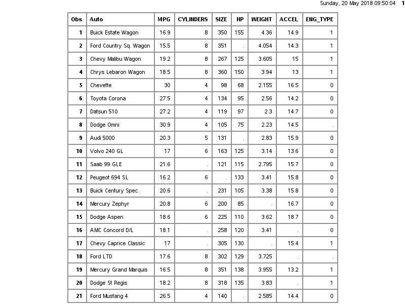
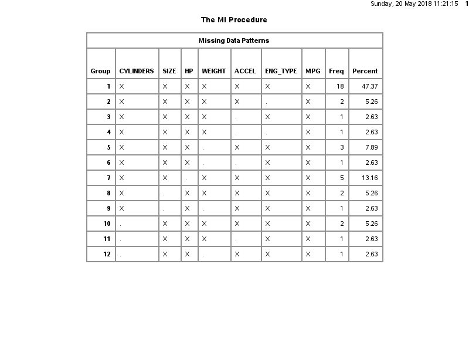

##Abstract  

Multiple imputation has validity under the assumption of missing at random or missing completely at random, but is not considered appropriate for the case where data is missing not completely at random. The rationale for this is that 
MCAR is a special case of MAR.  

SAS :  
For example, consider a trivariate data set with variables and fully observed, and a variable that has missing values. MAR assumes that the probability that is missing for an individual can be related to the individual’s values of variables and , but not to its value of . On the other hand, if a complete case and an incomplete case for with exactly the same values for variables and have systematically different values, then there exists a response bias for , and MAR is violated  
The MI and MIANALYZE procedures assume that the missing data are missing at random (MAR); that is, the probability that an observation is missing can depend on , but not on (Rubin 1976; 1987, p. 53).   

This evaluation considers a subset of the carmpg data set and evaluates the difference in results that are achieved by regression analysis on the data set as-received in comparison to the regression models built with the missing data imputed. The results of this evaluation demonstrates that the imputed data set has reduced error in the parameter estimates, and thus increased power in the resulting model.

The 

##Introduction  

The 1983 Data Exposition dataset was collected by Ernesto Ramos and David Donoho and dealt with automobiles. Data on mpg, cylinders, displacement, was provided for 406 different cars, each identified by name. Since the original publication that data set has been successivley cleaned and the typical version utilized in many studies contains 

The data set includes the following characteristics :
fuel consumption values (measured in miles per gallon) for 38 different vehicles and independent variables :  
  

  

| Variable Name  | Description                       | dependent, independent | data type |  
|----------------|------------------|---------------------|------------------|  
| auto           | automobile make, model | descriptive | text field |  
| mpg            | miles per gallon | dependent  | real, continuous |  
| cylinders      | number of cylinders | independent      | integer, cardinal|  
| size           | displacement, cu-in. | independent     | real, continuous |  
| hp             | horsepower           | independent     | real, continuous |  
| weight         | vehicle weight, klbs.     | independent         | real, continuous |  
| accel          | acceleration capability, ft/sec² | independent | real, continuous |  
| eng_type       | transmission (auto, manual) | independent | integer, binary |  
|----------------|------------------|---------------------|------------------|  

The data is the following :

  

##Literature review  

##Methods  

The procedue used is the following :  

    - read in raw data set to SAS  
    - construct baseline model using PROC REG  
        - PROC REG default is listwise deletion for any rows with missing data, baseline model is listwise deleted result  
    - observe missing-ness characteristics using PROC MI  
        - evaluate the missingness characteristics for MAR, MCAR, MNAR to consider if mulitple imputation is appropriate  
    - above evaluation indicates that data is MAR (at least), so that multiple imputation assumptions are met and is appropriate for this data set  
    - use PROC MIIII to complete multiple imputation on the data set  
        - since eng_type is binary valued (0,1) and cylinders is cardinal values (4,5,6,8) the option FCS is included in the PROC MIXXX imputation implementaiton to maintain the binary / integer characteristics of these data columns  
        
     - after completion of the imputation, the regression analysis is repeated on the five (5) imputed data sets, again using PROC REG  
     - the results of the independent regression models are combined to form the 'average' imputed regression model  
     - the results of the combined imputed regression model are compared to the baseline listwise deletion regression model  
        - the comparison is made based on standard errors of the model coefficients  
    
    

##Results  

  

Table 2 

##Future work/discussion/conclusion  

##Appendix - Code  

## References  

Int J Epidemiol. 2014 Aug; 43(4): 1336–1339.
Published online 2014 Apr 4. doi:  10.1093/ije/dyu080
PMCID: PMC4121561
PMID: 24706730
What is the difference between missing completely at random and missing at random?
Krishnan Bhaskaran* and Liam Smeeth
https://www.ncbi.nlm.nih.gov/pmc/articles/PMC4121561/

Statistical Assumptions for Multiple Imputation
https://support.sas.com/documentation/cdl/en/statug/63033/HTML/default/viewer.htm#statug_mi_sect016.htm

http://stat-computing.org/dataexpo/1983.html

http://lib.stat.cmu.edu/datasets/cars.desc

https://archive.ics.uci.edu/ml/datasets/auto+mpg

